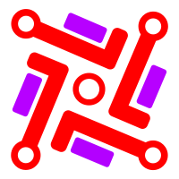

# Dokumental

  

<h4 align="center">A responsive web app made using <a href="https://reactjs.org/" target="_blank">React.js</a>.</h4>

## About The Project
Dokumental is the front-end component of the document classification project. 
It serves as the landing page for users to submit .txt or .docx files to the server which hosts a neural network classifier.
Once the readability for the documents have been ascertained, the server sends back the results to the web app which shows them to the users.

Currently it has the following screens:

- Home/Upload Page
- How It Works Page
- Results Page
- About Page

Almost all of the UI components are made from scratch without external CSS libraries.
Animations are powered by React Spring.

## Core Libraries

- [React.js](https://reactjs.org/)
- [React Redux](https://react-redux.js.org/)
- [Redux Saga](https://redux-saga.js.org/)
- [React Spring](https://www.react-spring.io/)
- [React Dropzone](https://react-dropzone.js.org/)

