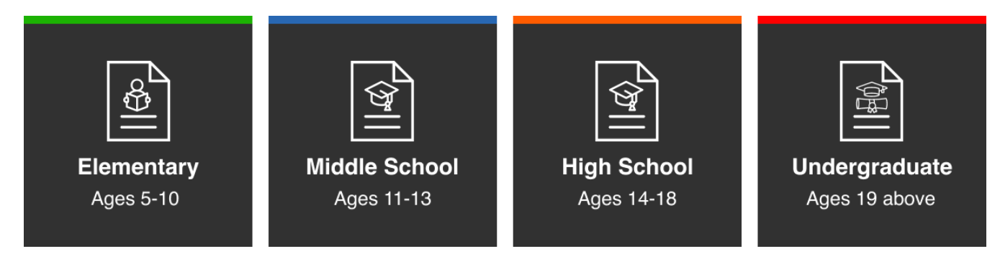
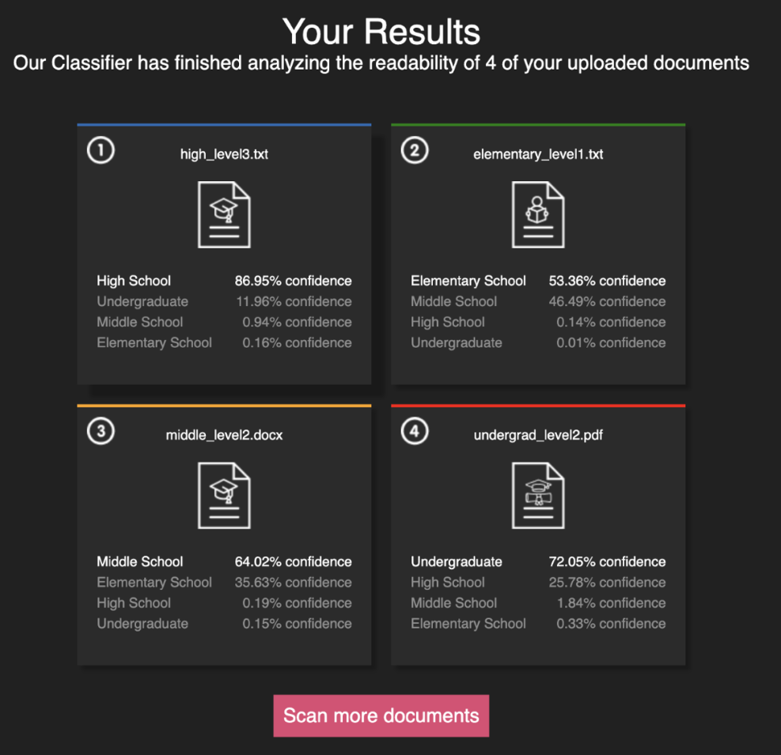

# Dokumental: Document Readability Classification

  

<h4 align="center">A responsive web app for document readability classification made using <a href="https://reactjs.org/" target="_blank">React.js</a> and <a href="https://www.djangoproject.com" target="_blank">Django</a></h4>

## Preface

Dokumental is a document classification project. It aims to address the lack of readability consideration in modern retrieval systems by developing a classifier capable of predicting a document’s readability based on the user’s comprehension level.

Users are able to submit files to the web app which hosts a neural network classifier in the server. The classifier classifies the documents' readability level and sends the results to be displayed to the users. 

Notes:
- At most 10 documents can be uploaded at once
- Same document cannot be uploaded twice

### Accepted file formats: 
- pdf
- txt
- docx

### Results are classified into the following categories: 

## Screenshots
### Home Page

### Document Dropzone

### Results Page

## Project Prerequisites

User must have the following downloaded and installed before proceeding to the following setup.

1. [Python](https://www.python.org) of v3.7 and above
2. [Node](https://nodejs.org/en) of v16 and above
3. [Yarn](https://classic.yarnpkg.com/en/) of v1.22 and above
4. [Pip](https://pypi.org/project/pip/21.3.1/) of v21.3 and above

## Frontend Setup

Refer to [Frontend installation](./frontend/README.md) for detailed steps. 

## Backend Setup

Refer to [Backend installation](./backend/README.md) for detailed steps.

## License
 
This project is licensed under [Apache License 2.0](https://opensource.org/licenses/Apache-2.0). All main conditions require preservation of copyright and license notices. View [LICENSE](/LICENSE) for more information.

